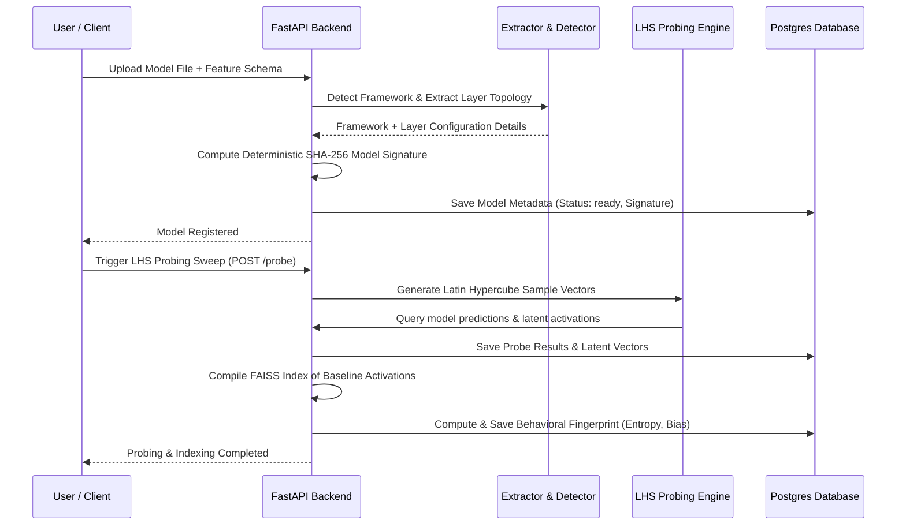
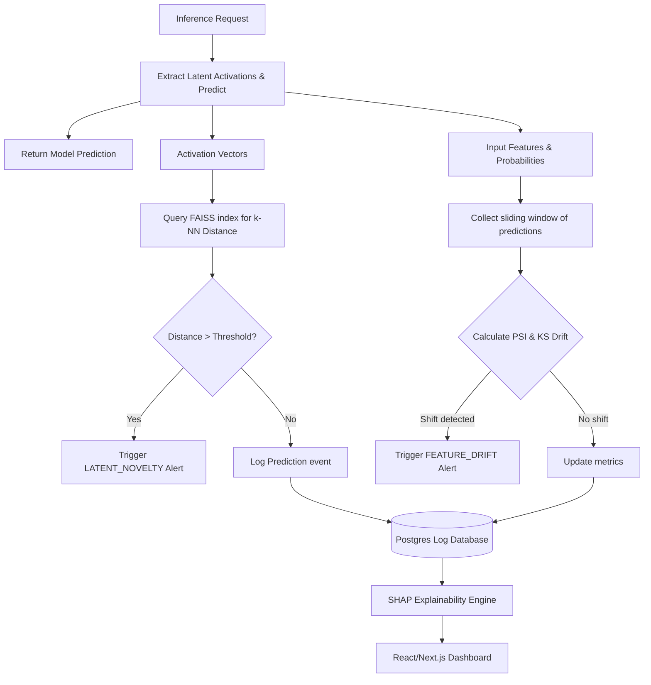

# ModelMesh

[](https://github.com/VaishnaviRai287/behavioral-model-observability-platform/actions/workflows/test.yml)

A self-hosted machine learning model behavioral analysis and observability platform. Registers trained models, probes their decision boundary using Latin Hypercube Sampling (LHS), builds a behavioral fingerprint, and monitors live inference for combinatorial novelty, feature drift, and explanation attribution. It uses the model's internal geometry, not just its outputs.

---

## Core Capabilities

Most machine learning monitoring tools watch the wrapper around a model, such as latency, HTTP error rate, and raw feature distributions. ModelMesh observes the model itself. It builds a geometric fingerprint at registration time and uses it to detect when live traffic is approaching regions the model has never confidently handled.

### Features

#### 1. Multi-Framework Autopsy
* Ingestion support for scikit-learn (.pkl, .joblib), PyTorch (.pt, .pth), TensorFlow/Keras (.h5, .keras, SavedModel directories), and ONNX (.onnx).
* Automatic framework detection and model architecture topology extraction.
* Unique deterministic model signature generation based on feature schema, layer structures, and parameter weights checksums.

#### 2. Decision Boundary Probing
* Latin Hypercube Sampling (LHS) probe sweeps across high-dimensional feature bounds to map model response behavior.
* Behavioral fingerprinting metrics: confidence histograms, output entropy, uncertainty rate, and class prediction bias.
* Wasserstein distance comparisons to detect shifts between baseline model versions.

#### 3. Behavioral Observability
* FAISS-indexed latent activation space monitoring.
* Real-time combinatorial novelty detection using k-nearest neighbor (k-NN) activation distance against the baseline probe activations.
* Kolmogorov-Smirnov (KS) statistic and Population Stability Index (PSI) drift detection for live feature inputs and prediction output distributions.
* Unified alert engine for latent novelty and statistical feature drift.

#### 4. Shapley Explanations
* Framework-agnostic Kernel SHAP implementation.
* Global feature importance mapping across representative probe samples.
* Local prediction explanations (SHAP contributions) detailing feature attributions for specific output classification confidences.
* Interactive Next.js visualization dashboard with custom SVG biometric scanning animations.

---

## System Architecture

The platform is split into model ingestion, boundary probing, real-time inference monitoring, and interactive explainability components.

### 1. Ingestion and Probing Pipeline

This diagram shows how models are uploaded, signatures computed, and the behavioral fingerprint generated using Latin Hypercube Sampling.



### 2. Inference and Monitoring Flow

This diagram illustrates how live predictions are evaluated in real time for novelty, drift, and explanations.



---

## Quickstart

Run the following commands to launch the full stack (database, Redis, Celery worker, backend API, and React frontend):

```bash
git clone https://github.com/VaishnaviRai287/behavioral-model-observability-platform
cd behavioral-model-observability-platform
docker compose down -v
docker compose up --build
```

* The interactive dashboard is available at **http://localhost:3000**.
* The interactive Swagger API documentation is available at **http://localhost:8000/docs**.

> **First run**: Open the dashboard, click **"Generate API Key"** on the registry page. No existing key is required for the first key (bootstrap rule). The key is saved in your browser and attached automatically to all subsequent requests.

> **Note**: Redis and a Celery worker are now required for drift detection. The `docker compose up` command starts all services together. To run locally without Docker, see the `PROJECT_STATUS.md` for the full local development setup.

---

## Directory Structure

```
├── app/
│   ├── database.py      # Database connection setup
│   ├── main.py          # FastAPI application configuration
│   ├── ml/              # Model wrappers (sklearn, PyTorch, Keras, ONNX)
│   ├── middleware/      # Request logging middleware
│   ├── models/          # SQLAlchemy database schema models
│   ├── monitoring/      # FAISS indexing, novelty scoring, drift detection, alert engine
│   ├── probing/         # Latin Hypercube Sampling boundary probe logic
│   ├── routers/         # FastAPI routes (models, explainability, alerts, api-keys)
│   ├── schemas/         # Pydantic serialization models
│   ├── services/        # Orchestration layer (model ingestion, SHAP, drift, performance)
│   ├── tasks/           # Celery async tasks (drift check)
│   └── utils/           # Architecture extractor, signature generator, API key auth
│
├── frontend/            # Next.js 14 dashboard (App Router)
│   ├── src/app/         # React pages (landing, registry, model dashboard, fingerprint)
│   └── src/lib/api.ts   # Typed API client wrapper (attaches Bearer token)
│
├── alembic/             # Database migration scripts (0001 to 0011)
├── tests/               # Pytest suite (97 tests)
├── demo/                # Sample models and drift traffic simulator
└── test_models/         # Pre-trained models for demo uploads
```

---

## API Endpoints

All endpoints (except `/health/*` and `/api/v1/api-keys` bootstrap) require an `Authorization: Bearer <key>` header.

```
# API Key Management
POST   /api/v1/api-keys                             Create a new API key (bootstrap: open if no keys exist)
GET    /api/v1/api-keys                             List all API keys (masked)
DELETE /api/v1/api-keys/{id}                        Revoke an API key

# Models
POST   /api/v1/models                              Register model and extract architecture
GET    /api/v1/models                              List all registered models
GET    /api/v1/models/{id}                         Get full model detail
DELETE /api/v1/models/{id}                         Delete a model and its file
GET    /api/v1/models/{id}/health                  Retrieve novelty rate and feature drift scores

# Probing & Fingerprinting
POST   /api/v1/models/{id}/probe                   Run Latin Hypercube Sampling probe sweep
POST   /api/v1/probes/{id}/fingerprint             Compile behavioral fingerprint & FAISS index
GET    /api/v1/fingerprints/{id}                   Get fingerprint by ID
GET    /api/v1/fingerprints/{id}/compare/{id2}     Compare two fingerprints
GET    /api/v1/models/{id}/fingerprints            List fingerprints for a model
GET    /api/v1/models/{id}/drift-status            Compare live traffic vs baseline fingerprint

# Inference & Monitoring
POST   /api/v1/models/{id}/predict                 Run inference (novelty scored at query time)
GET    /api/v1/models/{id}/predictions             Retrieve prediction logs history
GET    /api/v1/models/{id}/alerts                  Retrieve active alerts
POST   /api/v1/models/{id}/alerts/{aid}/resolve    Resolve an alert
GET    /api/v1/models/{id}/drift                   List drift events
GET    /api/v1/models/{id}/drift-analysis          Full drift analysis with distributions
GET    /api/v1/models/{id}/dataset-health          Dataset health metrics
GET    /api/v1/models/{id}/performance             Latency, throughput, CPU & memory stats

# Explainability
GET    /api/v1/models/{id}/explainability/global         Global SHAP feature importances
GET    /api/v1/models/{id}/predictions/{pid}/explain     Local SHAP breakdown for one prediction

# Health
GET    /health/live                                Liveness probe
GET    /health/ready                               Readiness probe (checks DB connectivity)
```

---

## Running Verification

### Run the Demo Simulator
The demo script uploads a model, runs the ingestion pipeline (probe and fingerprint), sends 30 normal predictions, and then injects 45 drifted predictions.

> **Requires**: A running API with a valid API key. The demo script will bootstrap a key automatically if none exists.

In a separate terminal, run:
```bash
python demo/run_demo.py
```
Observe the live dashboard at **http://localhost:3000** to watch the novelty timeline cross the threshold and trigger real-time alerts.

### Run the Test Suite
You can execute the unit test suite locally using an in-memory SQLite database configuration:

```bash
TEST_DATABASE_URL=sqlite:///./test.db .venv/bin/pytest -q
```

> Auth is automatically disabled under `TEST_DATABASE_URL` so no API key headers are needed in tests. See `tests/test_api_keys.py` for the auth enforcement tests.
