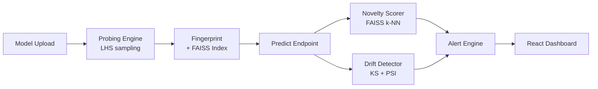

# ModelMesh

[](https://github.com/VaishnaviRai287/behavioral-model-observability-platform/actions/workflows/test.yml)

A self-hosted ML model behavioral analysis engine. Registers trained models,
probes their decision boundary using Latin Hypercube Sampling, builds a
behavioral fingerprint, and monitors live inference for combinatorial novelty
and feature drift — using the model's internal geometry, not just its outputs.

---

<!-- Replace with your recorded demo GIF once the system is running -->
<!-- Suggested flow: registry page → upload model → drift simulation → alert firing -->
<!--  -->

---

## What it does

Most ML monitoring tools watch the wrapper around a model — latency, error
rate, feature distributions. ModelMesh watches the model itself. It builds a
geometric fingerprint at registration time and uses it to detect when live
traffic is approaching regions the model has never confidently handled.

---

## Architecture



---

## Quickstart

```bash
git clone https://github.com/VaishnaviRai287/behavioral-model-observability-platform
cd behavioral-model-observability-platform
docker-compose up
```

Open **http://localhost:3000** — the dashboard is live.
API docs at **http://localhost:8000/docs**.

---

## Run the demo

With the stack running, in a separate terminal:

```bash
python demo/run_demo.py
```

Uploads a sample logistic regression model, sends 30 normal predictions,
then 45 drifted predictions. Watch the novelty timeline at
`localhost:3000` — dots will cross the threshold line and a
`LATENT_NOVELTY` + `FEATURE_DRIFT` alert will fire in real time.

Alternatively, use the **Simulate Drift Traffic** button directly inside
the model dashboard — no CLI needed.

## Run the test suite

Run the pytest suite locally using an in-memory SQLite database without needing to spin up PostgreSQL or Docker:

```bash
TEST_DATABASE_URL=sqlite:///./test.db .venv/bin/pytest
```

---

## What's inside

**V1 — Model Autopsy**
- Multi-framework model ingestion with automatic framework detection (**scikit-learn, PyTorch `.pt`/`.pth`, TensorFlow/Keras `.h5`/`.keras`/`SavedModel`, ONNX**)
- Automatic model architecture extraction and visual layer configuration analysis
- Latin Hypercube Sampling probe sweep across the full feature space
- Behavioral fingerprint: confidence histogram, entropy, uncertainty rate, class bias
- Fingerprint comparator (Wasserstein distance) for detecting baseline shift

**V2 — Behavioral Monitoring**
- FAISS-indexed latent space monitor — detects combinatorial novelty at inference time using k-NN distance against probe activations
- KS + PSI statistical drift detection per feature against probe baseline
- Alert engine with `LATENT_NOVELTY` and `FEATURE_DRIFT` alert types, severity escalation, and resolve workflow
- React dashboard with live polling — novelty timeline, per-feature drift bar chart, active alert management, behavioral fingerprint viewer, and extracted model architecture topology view

---

## Stack

| Layer | Technology |
|---|---|
| Backend | FastAPI, SQLAlchemy, Alembic, PostgreSQL |
| ML | scikit-learn, PyTorch, TensorFlow/Keras, ONNX Runtime, FAISS, scipy, NumPy |
| Frontend | Next.js 14, Tailwind CSS, Recharts |
| Infra | Docker Compose, GitHub Actions CI |

---

## Structure

```
app/
├── ml/              # model wrappers — sklearn, PyTorch, TensorFlow, ONNX
├── probing/         # LHS sampler + forward-pass probe engine
├── monitoring/      # FAISS indexer, novelty scorer, drift detector, alert engine
├── services/        # orchestration layer for each domain
├── routers/         # FastAPI route handlers
├── utils/           # framework detector & architecture extractor utilities
│
frontend/            # Next.js 14 dashboard (App Router)
alembic/             # database migrations
tests/               # pytest suite (77 tests)
demo/                # sample model + demo script
```

---

## API

```
POST   /api/v1/models                              register model + auto-detect framework & extract architecture
GET    /api/v1/models                              list all registered models
POST   /api/v1/models/{id}/probe                   run LHS probe sweep
POST   /api/v1/probes/{id}/fingerprint             compile behavioral fingerprint + FAISS index
POST   /api/v1/models/{id}/predict                 run inference (novelty scored at query time)
GET    /api/v1/models/{id}/health                  novelty rate + per-feature drift scores
GET    /api/v1/models/{id}/alerts                  active LATENT_NOVELTY / FEATURE_DRIFT alerts
GET    /api/v1/models/{id}/predictions             inference timeline (last 100)
GET    /api/v1/fingerprints/{id}/uncertainty-regions  dynamically computed uncertainty regions
```

Full interactive docs at **http://localhost:8000/docs** after `docker-compose up`.

---


- [x] V1 — Model autopsy: multi-framework ingestion, LHS probing, behavioral fingerprinting, auto architecture extraction
- [x] V2 — Latent space monitoring: FAISS novelty detection, KS/PSI drift detection, alert engine, React dashboard
- [ ] V3 — Streaming ingestion via Kafka, per-cohort drift segmentation, fingerprint versioning
