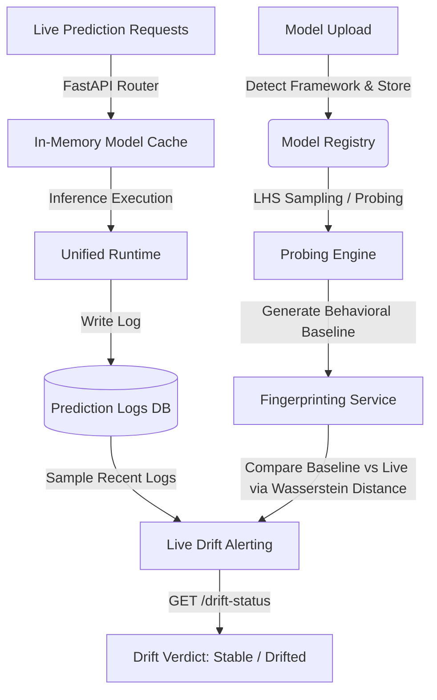

# ModelMesh: Behavioral Model Observability Platform

ModelMesh is a production-grade machine learning model serving and behavioral observability platform. It allows engineers to register models across multiple frameworks (Scikit-Learn, PyTorch, ONNX), explore model behaviors under controlled conditions using Latin Hypercube Sampling (LHS), signature them as statistical fingerprints, serve live predictions with sub-millisecond in-memory caching, and continuously monitor for live behavioral drift against the baseline fingerprint.

---

## 🏗️ Architecture & System Flow



---

## ⚡ Key Capabilities

*   **Unified Model Registry & Runtime**: Support for `.pkl` (Scikit-Learn), `.pt` (PyTorch), and `.onnx` model files with automatic framework detection, input schema validation, and bound-checking.
*   **Latin Hypercube Sampling (LHS) Probing**: Automatically generates uniform multidimensional test points within feature boundary constraints to safely probe model predictions.
*   **Behavioral Fingerprinting**: Captures the model's signature using 4 metrics:
    1.  *Confidence Histogram* (10-bin probability density)
    2.  *Entropy* (Normalized predictive uncertainty)
    3.  *Uncertainty Rate* (Ratio of confidence values below $0.6$)
    4.  *Class Bias* (Dominant class frequency)
*   **Live Drift Alerting**: Compares live production traffic logs against stored baseline fingerprints using Earth Mover's Distance / Wasserstein Distance, computing an exact similarity score and returning stable, drifted, or severely drifted verdicts.
*   **Production Readiness Features**:
    *   *In-Memory Wrapper Cache*: Dict-based model cache that eliminates disk I/O and pickle deserialization on hot paths.
    *   *Structured Request Logging*: Emits JSON request lines with unique Request UUID correlation and latency tracking.
    *   *Health Probes*: Exposes `/health/live` (liveness probe) and `/health/ready` (readiness probe checking database connectivity and cache size).

---

## 🚀 Setup & Installation

### 1. Prerequisites
Ensure you have Python 3.10+ installed.

### 2. Install Dependencies
Create a virtual environment and install the required libraries:
```bash
python3 -m venv .venv
source .venv/bin/activate
pip install -r requirements.txt
```

### 3. Run Database Migrations
Initialize database schemas:
```bash
alembic upgrade head
```

### 4. Run the API Server
Start the Uvicorn ASGI server locally:
```bash
uvicorn app.main:app --reload --host 0.0.0.0 --port 8000
```
The interactive Swagger API documentation will be available at `http://localhost:8000/docs`.

---

## 🎮 Interactive Demo

We have provided a script, `demo.py`, that executes a complete end-to-end simulation of registering a model, generating its baseline fingerprint, executing live queries, and checking for drift.

With the server running on port 8000, execute:
```bash
python3 demo.py
```

### Demo Steps Executed:
1.  **Trains** a Scikit-Learn Logistic Regression model locally.
2.  **Uploads & registers** it to the platform.
3.  **Probes** the model with 100 LHS points to compute prediction stats.
4.  **Generates the baseline fingerprint** for the probe session.
5.  **Simulates live traffic** by executing 15 prediction requests.
6.  **Computes the drift verdict** on live traffic logs.
7.  **Checks production health status** and model cache allocation.
8.  **Cleans up** by deleting the test model and invalidating its cache.

---

## 🧪 Testing

To run the complete suite of 66 automated tests:
```bash
pytest tests/ -v
```

---

## 📖 API Endpoints Reference

### 1. Model Registry
*   `POST /api/v1/models` - Register/Upload a model file along with its metadata and schema.
*   `GET /api/v1/models` - List all registered models.
*   `GET /api/v1/models/{model_id}` - Retrieve metadata for a model.
*   `DELETE /api/v1/models/{model_id}` - Delete a model record, its file, and evict it from memory.

### 2. Probing & Fingerprinting
*   `POST /api/v1/models/{model_id}/probe` - Trigger an LHS probe session on a model.
*   `GET /api/v1/probes/{session_id}` - Fetch probe session results.
*   `POST /api/v1/probes/{session_id}/fingerprint` - Create a baseline fingerprint from a completed probe session.
*   `GET /api/v1/fingerprints/{fingerprint_id}` - Retrieve a fingerprint by ID.
*   `GET /api/v1/models/{model_id}/fingerprints` - Retrieve all baseline fingerprints for a model.
*   `GET /api/v1/fingerprints/{fp_a_id}/compare/{fp_b_id}` - Compute Wasserstein distance and similarity between two fingerprints.

### 3. Prediction Service & Monitoring
*   `POST /api/v1/models/{model_id}/predict` - Submit a prediction request with validation.
*   `GET /api/v1/models/{model_id}/predictions` - List recent prediction logs for the model.
*   `GET /api/v1/models/{model_id}/drift-status` - Query real-time drift verdict on recent traffic.

### 4. Health Checks
*   `GET /health/live` - Returns `200 OK` liveness status.
*   `GET /health/ready` - Returns readiness status (including database connection check and cache size).
